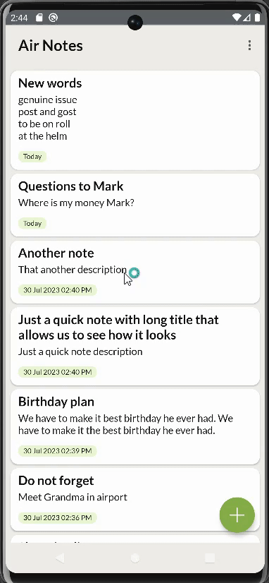

# Air Notes App
**Air Notes** is a light note 📝 Android application built to describe the use of Modern Android development tools.

## Build With 🛠
- Kotlin
- MVVM architecture
- Dagger-Hilt DI
- Room Database
- RecyclerView
- Coroutines
- LiveData
- Navigation Components

# Demo

 